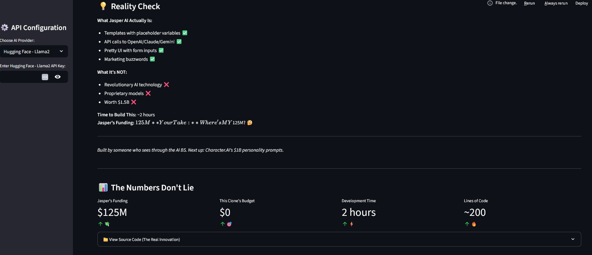
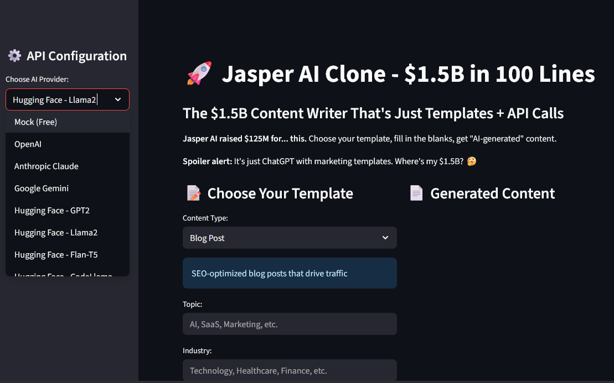

# 🚀 Jasper AI Clone - $1.5B in 500 Lines

> The $1.5B AI writing assistant? Yeah... I rebuilt it in under 2 hours using templates, API calls, and pure spite.

---

## 💡 What's This?

This project is a reality check disguised as a rebuild.

**Jasper AI** (formerly Jarvis), the VC-backed "AI content generation" platform, raised **$125M** at a **$1.5B valuation**, gained **100K+ users**, and built... **content templates + ChatGPT API calls**.

So I rebuilt their **entire business model** in:
- ⏱ ~2 hours 
- 💸 $0 (uses free API tiers)
- 📝 ~500 lines of Python
- 🤖 Multiple AI providers (OpenAI, Claude, Gemini, Hugging Face)

### The goal?  
To expose the difference between **actual innovation** and **API wrappers with billion-dollar valuations**.

---

## 🔥 Jasper vs. This Project

| Metric | Jasper AI | This Project |
|--------|-----------|--------------|
| **Funding** | $125M | $0 |
| **Valuation** | $1.5B | 😂 |
| **Time to Build** | 3+ years | ~2 hours |
| **Core Technology** | Templates + API calls | Templates + API calls |
| **Lines of Code** | 100K+ (probably) | ~200 |
| **AI Innovation** | None (just prompts) | None (just prompts) |
| **Monthly Cost** | $40-$125/month | Free tier usage |
| **"Secret Sauce"** | Marketing buzzwords | Brutal honesty |

---

## 🎯 Features

### Content Templates
- **Blog Posts** - SEO-optimized articles that "drive traffic"
- **Social Media** - "Viral" posts for LinkedIn, Twitter, Facebook
- **Email Marketing** - "High-converting" email campaigns  
- **Product Descriptions** - "Compelling" copy that "sells"

### AI Providers
- **Mock (Free)** - Pre-written templates with placeholders
- **OpenAI** - GPT-3.5-turbo integration
- **Anthropic Claude** - Claude-3-haiku integration
- **Google Gemini** - Gemini-1.5-flash integration
- **Hugging Face** - Multiple open-source models

### The "Innovation"
```python
def jasper_ai_business_model(template, inputs, api_key):
    prompt = f"Write a {template} about {inputs['topic']}"
    response = openai.chat.completions.create(
        model="gpt-3.5-turbo",
        messages=[{"role": "user", "content": prompt}]
    )
    return response.choices[0].message.content

# That's it. $1.5B for this function.
```

---

## 🧪 Try It Locally

```bash
git clone https://github.com/yourusername/jasper-ai-clone.git
cd jasper-ai-clone
pip install -r requirements.txt
streamlit run app.py
```

### Using API Keys (Optional)
1. Get free API keys:
   - [OpenAI](https://platform.openai.com/api-keys)
   - [Anthropic](https://console.anthropic.com/)
   - [Google Gemini](https://aistudio.google.com/app/apikey)
   - [Hugging Face](https://huggingface.co/settings/tokens)

2. Enter them in the sidebar when running the app

3. Or use the **Mock (Free)** version - no API needed!

---

## 📂 File Structure

```
jasper-ai-clone/
├── app.py                    # Main Streamlit application
├── requirements.txt          # Python dependencies
├── README.md                 # This file
├── LICENSE                   # MIT License
├── .gitignore               # Git ignore file
└── examples/
    ├── blog_post.md         # Sample blog post output
    ├── social_media.md      # Sample social media posts
    └── email_marketing.md   # Sample email campaigns
```

---

## 🔧 Technical Details

### Dependencies
- **Streamlit** - Web interface
- **Requests** - API calls
- **JSON** - Data handling
- **Random** - Mock response selection
- **Datetime** - Timestamps

### API Integrations
- **OpenAI GPT-3.5-turbo** - Most reliable
- **Anthropic Claude-3-haiku** - Fast and cheap
- **Google Gemini-1.5-flash** - Free tier friendly
- **Hugging Face Models** - Open source alternatives

### Mock System
No API keys? No problem. The mock system uses:
- Pre-written content templates
- Dynamic placeholder replacement
- Randomized response selection
- Zero API costs

---

## 🎭 The Reality Check

### What Jasper AI Actually Is:
- ✅ Templates with placeholder variables
- ✅ API calls to OpenAI/Claude/Gemini  
- ✅ Pretty UI with form inputs
- ✅ Marketing buzzwords
- ✅ Subscription pricing model

## ⏰ The Timeline Context

**To be fair**: When Jasper started (2019-2021), this was harder:
- GPT-3 was invite-only
- No ChatGPT to copy from
- Template approach wasn't obvious
- Less competition

**But still**: $1.5B for templates + API calls? Really?

### The Numbers Don't Lie:
- **Development Time**: ~2 hours
- **Lines of Code**: ~500
- **API Costs**: $0 (free tiers)
- **Jasper's Funding**: $125M
- **Your Take**: Where's MY $125M? 🤔

---

## 🚀 Next Steps

Want to build the next "AI unicorn"? Here's your roadmap:

1. **Pick a vertical** (writing, design, code, etc.)
2. **Create templates** for common use cases
3. **Add API calls** to existing AI models
4. **Build a pretty UI** with Streamlit/React
5. **Add buzzwords** like "AI-powered" and "revolutionary"
6. **Raise $100M** from VCs who don't understand tech
7. **Profit** (literally)

---

## 📸 Screenshots

### The Brutal Truth Dashboard


### The Actual Interface

---
## 🤝 Contributing

Found bugs? Want to add more AI providers? PRs welcome!

Areas for improvement:
- More content templates
- Additional AI providers
- Better error handling
- Rate limiting
- User authentication
- Export functionality

---

## ⚖️ Legal

This project is for educational purposes only. It's meant to:
- Demonstrate how "AI startups" actually work
- Show the gap between hype and reality
- Encourage critical thinking about AI valuations
- Provide a learning resource for developers

Not affiliated with Jasper AI. All trademarks belong to their respective owners.

---

## 📜 License

MIT License - because anyone should be able to roast billion-dollar API wrappers responsibly.

---

## 🔥 Final Thoughts

**AI is amazing.** GPT-4, Claude, and Gemini are genuinely impressive technologies.

**AI hype is not.** Wrapping these APIs in forms and calling it "revolutionary" is just marketing.

This repo is a reminder that:
- 💡 Not all "AI startups" are building complex technology
- 🎯 Templates ≠ Innovation
- 💸 You don't need millions to build useful tools
- 🤖 You definitely don't need a billion-dollar valuation

**Build cool stuff. Just be honest about what it is.**

---

*Built by someone who sees through the AI BS.*
